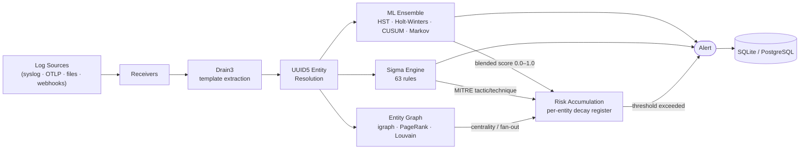

# Seerflow

A streaming, entity-centric log intelligence agent that detects operational failures and security threats across log sources. Combines traditional ML (fast, cheap) for bulk detection with Sigma rules (3,000+ community detections) for known threat patterns.

## Status

**Alpha** — Full ingestion + detection + Sigma rules pipeline operational.

[](https://github.com/seerflow/seerflow/actions/workflows/ci.yml)
[](https://pypi.org/project/seerflow/)
[](https://www.python.org/)
[](LICENSE)

## Installation

### From PyPI (recommended — fastest path)

```bash
pip install seerflow
# or, with uv:
uv pip install seerflow
```

The wheel bundles the pre-built React dashboard, the 63 curated Sigma rules,
and every runtime dependency. No build step, no Node toolchain required.

### From source

```bash
git clone https://github.com/seerflow/seerflow.git
cd seerflow
uv sync
```

Use the source install for development or to run the latest unreleased
changes. See [CONTRIBUTING.md](CONTRIBUTING.md) for the full dev setup.

## Quick Start

### Zero to first alert in under 5 minutes

These steps take **well under 5 minutes** on a fresh machine — no Docker, no
database, no config file, no tuning required (Seerflow runs zero-config with
sensible defaults — NFR-006):

1. **Install** (~30s): `pip install seerflow`
2. **Start the pipeline** (~10s): `seerflow start` — boots receivers,
   detection engines, and the dashboard with built-in defaults (SQLite,
   syslog + OTLP + webhooks). No config file needed for the first run.
3. **Send a log line that trips an anomaly or Sigma rule** (~1m, see the
   syslog example below) and watch the `WARNING ANOMALY ...` /
   `WARNING SIGMA ...` line print to the console and the alert appear in the
   dashboard at `http://127.0.0.1:8080/`.

Total: well inside 5 minutes — install dominates, detection is instant once
events flow. Drop in a `seerflow.yaml` (copy `seerflow.example.yaml`) only
when you want to change ports, backends, or detector tuning.

```bash
# Install from source
git clone https://github.com/seerflow/seerflow.git
cd seerflow
uv sync

# Copy and edit the example config
cp seerflow.example.yaml seerflow.yaml

# Start the pipeline (also serves the React dashboard)
uv run python -m seerflow start
# → React dashboard:  http://127.0.0.1:8080/
# → REST API:         http://127.0.0.1:8080/api/v1/
# → WebSocket stream: ws://127.0.0.1:8080/api/v1/ws
```

A single `seerflow start` boots the receivers, detection engines, and the
FastAPI dashboard on `dashboard_port` (default `8080`). No second uvicorn
process is required — the wheel ships the built React assets and the CLI
mounts them via the same FastAPI app that exposes `/api/v1/*`.

### Command Line

```bash
# Start with default config (seerflow.yaml in current directory)
uv run python -m seerflow start

# Start with a specific config file
uv run python -m seerflow --config /path/to/seerflow.yaml start

# Show version
uv run python -m seerflow --version
```

### Inspect loaded detection rules

```bash
# List everything
uv run python -m seerflow rules list

# Only rules tagged with a MITRE technique (prefix match includes sub-techniques)
uv run python -m seerflow rules list --technique T1053

# Filter by tactic (name or ATT&CK ID)
uv run python -m seerflow rules list --tactic persistence
uv run python -m seerflow rules list --tactic TA0003

# JSON for scripting
uv run python -m seerflow rules list --format json
```

### Docker

```bash
# Build and run with SQLite defaults (zero config)
docker compose up -d

# Run with PostgreSQL (set password first)
export POSTGRES_PASSWORD=your-secure-password
docker compose --profile postgres up -d

# Or run standalone from a registry image
docker run -p 8080:8080 -p 4317:4317 -p 514:514/udp seerflow/seerflow

# Mount a custom config
docker run -v ./seerflow.yaml:/app/seerflow.yaml:ro seerflow/seerflow
```

### What It Does

1. **Ingests** logs from multiple sources simultaneously (syslog, OTLP gRPC/HTTP, file tailing, webhooks)
2. **Parses** each log line with Drain3 (template extraction) and regex entity extraction (IPs, users, hosts, files, domains, processes)
3. **Resolves** entities to deterministic UUID5 IDs for cross-source correlation
4. **Scores** events with an ML ensemble: Half-Space Trees (content), Holt-Winters (volume), CUSUM (change), Markov chains (sequence) -- blended with z-normalization
5. **Thresholds** scores with biDSPOT (EVT-based auto-threshold -- no manual tuning)
6. **Evaluates** 63 bundled Sigma rules (Linux, web, DNS, process, network) with MITRE ATT&CK tagging
7. **Graphs** entity relationships with igraph -- PageRank, Louvain, fan-out, betweenness centrality
8. **Accumulates** per-entity risk with exponential decay -- catches slow-burn multi-step attacks
9. **Alerts** on anomalies, Sigma matches, and risk threshold exceedances
10. **Persists** all events, alerts, graph edges, and ML model state to SQLite

### Example: Detect Anomalies in Syslog

```yaml
# seerflow.yaml
receivers:
  syslog_enabled: true
  syslog_udp_port: 5514       # use high port to avoid root
  otlp_grpc_enabled: false
  otlp_http_enabled: false
  webhook_enabled: false

detection:
  hst_window_size: 100         # lower for faster calibration
  dspot:
    calibration_window: 200
    risk_level: 0.01           # more sensitive for testing
```

```bash
# Terminal 1: Start Seerflow
uv run python -m seerflow start

# Terminal 2: Send normal traffic
for i in $(seq 1 300); do
    echo "<134>1 2026-03-24T19:00:00Z web nginx $i - - GET /api/v$((i%5)) 200 ${i}ms" \
        | nc -u -w1 127.0.0.1 5514
done

# Terminal 2: Send anomalies
echo '<11>1 2026-03-24T19:01:00Z db postgres 999 - - FATAL connection limit exceeded 847/100' \
    | nc -u -w1 127.0.0.1 5514
```

Output:
```
INFO Seerflow 0.3.0 starting
INFO Receivers: syslog
INFO Pipeline running — Ctrl+C to stop
WARNING ANOMALY [syslog] score=0.952 threshold=0.009 dir=upper
WARNING   template: [7] <*> <*> postgres <*> - - FATAL connection limit exceeded <*>
WARNING   message:  <11>1 2026-03-24T19:01:00Z db postgres 999 - - FATAL connection limit exceeded 847/100
WARNING   entities: 203.0.113.1
```

### Shutdown Summary

Press Ctrl+C to see session stats:

```
INFO --- Session Summary ---
INFO   Events processed: 312
INFO   Anomalies detected: 10
INFO   Unique templates: 7
INFO   Duration: 45.3s
INFO   Throughput: 7 events/sec
INFO Seerflow stopped
```

## Configuration

See [SETTINGS.md](SETTINGS.md) for the complete configuration reference.

All settings are optional -- Seerflow runs with sensible defaults (zero-config).

Key config sections:
- **receivers** -- syslog, OTLP gRPC/HTTP, file tailing, webhooks (enable/disable + ports)
- **detection** -- HST window size, DSPOT calibration, scoring weights, custom Sigma rule directories
- **storage** -- SQLite (default) or PostgreSQL
- **alerting** -- dedup window, webhook/PagerDuty targets

## Receivers

| Receiver | Port | Protocol | Status |
|----------|------|----------|--------|
| Syslog UDP/TCP | 514 (5514) | RFC 5424/3164 | Done |
| OTLP gRPC | 4317 | Protobuf | Done |
| OTLP HTTP | 4318 | Protobuf + JSON | Done |
| File tailing | -- | Glob + watchfiles | Done |
| Webhooks | 8081 | JSON/form + auth | Done |

## Validation

Seerflow is validated by running the **full detection stack** (Drain3 ->
ML ensemble -> Sigma -> UEBA -> IoC -> correlation -- the exact
`seerflow start` wiring via `assemble_handler`, S-305/FR-073) against a
**synthetic LANL subset** (~200 events modelled on the LANL Unified Host
and Network Dataset, committed at `tests/fixtures/lanl/`). This exercises
the real product, not a correlation-only shortcut. The numbers below are
honestly scoped to this small synthetic subset -- online/cold-start
detectors (ML/UEBA) warm up but rarely fire on so few events, which the
per-family breakdown in the generated report makes explicit.

| Metric | Value |
|--------|-------|
| Precision | 16.67% |
| Recall | 33.33% |
| F1 score | 22.22% |
| False-positive rate | 83.33% |
| AUC | 0.0000 |
| Events processed | 137 |

Attack-level metrics (FR-079 / S-311) -- per red-team scenario
mean-time-to-detect, precision-recall + ROC curves, AUC over a risk-score
threshold sweep, and the silent detector family for every missed red-team
event -- are emitted by the full report (`python -m seerflow.lanl.report`)
and by `seerflow validate <dir> --json`. On this small synthetic subset
only the C2-beaconing scenario is detected; the brute-force and
credential-stuffing scenarios are missed by the (cold-start) stack and
attributed to the `correlation` family in the JSON output.

> Numbers are derived from the full-stack harness, not hand-maintained --
> a drift test (`tests/integration/test_lanl_report_drift.py`) fails if
> this table diverges from `run_validation()`. Scope: synthetic LANL
> subset, full detection stack (not "end-to-end on the full LANL dataset").

Reproduce locally:

```bash
uv run pytest tests/integration/test_lanl_validation.py -v
uv run python -m seerflow.lanl.report
```

To run against the **full LANL 2015 dataset**: download it through LANL's
self-service token gate with `tools/download_lanl.sh --email you@example.com`
(prompts if you omit the email), then `seerflow validate data/lanl` — use the
streaming API for the full ~1.6B-event set. Step-by-step walkthrough, dataset
schema, and additional tests:
[documents/testing-seerflow-against-lanl.md](documents/testing-seerflow-against-lanl.md).

## Architecture



- **Drain3**: Streaming log template extraction (120K msgs/sec)
- **UUID5 Entity Resolution**: Deterministic cross-source entity IDs (same entity = same UUID)
- **Half-Space Trees**: Content anomaly detection via River (constant time/memory)
- **Holt-Winters**: Volume anomaly detection (trend + seasonal decomposition)
- **CUSUM**: Change-point detection (bidirectional cumulative sum)
- **Markov Chains**: Sequence anomaly detection (per-entity transition matrices)
- **biDSPOT**: Bidirectional EVT auto-threshold (upper spikes + lower drops)
- **DetectionEnsemble**: Orchestrates all detectors + blended scoring per source
- **Sigma Engine**: 63 bundled SigmaHQ rules with logsource-indexed dispatch
- **Entity Graph**: igraph-backed relationship graph with typed edges + 6 algorithms
- **Risk Accumulation**: Per-entity risk register with exponential decay + configurable threshold
- **Sliding Window**: Per-entity event buffer with watermark-based late arrival tolerance

## Development

Requires Python 3.11+ and [uv](https://docs.astral.sh/uv/).

```bash
# Install dependencies
uv sync

# Run tests
uv run pytest

# Run quality gates
uv run ruff check . && uv run ruff format --check . && uv run mypy src/ && uv run bandit -r src/ -c pyproject.toml && uv run pytest --cov=src/seerflow --cov-fail-under=95
```

### Project Structure

```
src/seerflow/
    __main__.py      # CLI entry point (config → pipeline → detection → storage)
    cli.py           # argparse (--config, --version)
    config.py        # YAML config loader with ${ENV_VAR} interpolation
    models/          # SeerflowEvent, Alert, entity structs (msgspec)
    storage/
        protocols.py # Protocol interfaces (LogStore, AlertStore, ModelStore, EntityStore)
        sqlite.py    # SQLite backend (WAL, FTS5, WriteBuffer)
        migrations.py # Schema versioning + forward-only migration runner
    receivers/
        base.py      # RawEvent dataclass, Receiver protocol
        manager.py   # ReceiverManager (bounded queue, backpressure, shutdown)
        syslog.py    # UDP/TCP syslog (RFC 5424/3164)
        otlp_grpc.py # OTLP gRPC receiver (protobuf LogRecord)
        otlp_http.py # OTLP HTTP receiver (/v1/logs, protobuf + JSON)
        file_tail.py # File tailing (glob, rotation, checkpoint)
        webhook.py   # Webhooks (JSON/form, field mapping, auth)
    parsing/
        drain.py     # Drain3 wrapper for template extraction
        entities.py  # Regex entity extraction (6 types, params-aware tagging)
        normalizer.py # EventNormalizer: RawEvent → SeerflowEvent
    detection/
        protocols.py # Detector Protocol (score, learn, serialize, deserialize)
        hst.py       # Half-Space Trees detector (River)
        threshold.py # biDSPOT auto-threshold (scipy GPD)
        ensemble.py  # DetectionEnsemble orchestrator (4 detectors + blended scoring)
    sigma/
        engine.py    # SigmaEngine: rule loading, logsource dispatch, evaluation
        matcher.py   # Custom detection matcher (condition tree walker, regex cache)
        pipeline.py  # pySigma processing pipeline (22 field mappings)
        attack.py    # MITRE ATT&CK tactic/technique extraction
        bundled.py   # Bundled rule path discovery (importlib.resources)
        loader.py    # Custom rule directory discovery + validation
        rules/       # 63 curated SigmaHQ YAML rules (linux, web, dns, process, network)
    graph/
        entity_graph.py # igraph wrapper: vertices, edges, queries, algorithms
        edges.py     # Typed edge inference from entity pairs
        algorithms.py # PageRank, Louvain, fan-out, fan-in, betweenness, ego-graph
    correlation/
        window.py    # Per-entity sliding window buffer (deque, LRU eviction)
        watermark.py # Watermark-based late arrival tolerance
        risk.py      # Risk accumulation with exponential decay
    pipeline/
        handler.py   # Event handler: parse → detect → graph → correlate → store
        run.py       # Pipeline runner (config → receivers → handler → storage)
tests/
    unit/            # 1200+ unit tests
    integration/     # Integration tests (pipeline, graph, correlation, real SQLite)
    benchmarks/      # Throughput benchmarks (pytest-benchmark, CI history tracking)
```

### Benchmarks

Benchmarks are produced by a committed, runnable harness — not hand-typed.
Reproduce the full-pipeline benchmark on your own hardware:

```bash
python -m seerflow.launch.benchmark --count 20000 --markdown
```

Component micro-benchmarks (pytest-benchmark, CI history tracking):

```bash
uv run pytest tests/benchmarks/ --benchmark-autosave
uv run pytest tests/benchmarks/ --benchmark-compare
```

Representative measured figures (commodity hardware, synthetic syslog
workload — your numbers will differ; reproduce with the command above):

| Component | Throughput |
|-----------|-----------|
| Syslog parse | ~561K msgs/sec |
| Drain3 templates | ~120K msgs/sec |
| Entity extraction | ~41K msgs/sec |
| Full normalizer | ~39.5K msgs/sec |
| **Full pipeline** (parse + ML + Sigma + storage) | measured by `python -m seerflow.launch.benchmark` |

Detection quality (precision / recall / F1 / FP-rate) is validated
separately — see [Validation](#validation).

## How Seerflow Compares

Seerflow is not a SIEM replacement — it is a lightweight, streaming anomaly +
detection layer you can run in minutes. Comparison is category-level
(deployment posture and approach), not a feature-for-feature scorecard:

| Dimension | Seerflow | Wazuh | OpenSearch | Splunk |
|-----------|----------|-------|------------|--------|
| Primary model | Streaming entity-centric anomaly + rule detection | Host-agent XDR / SIEM | Search + analytics engine (security analytics plugin) | Log analytics + SIEM platform |
| Deployment | Single `pip install`, zero-config, SQLite default | Manager + agents + indexer (Elastic stack) | Cluster (data/manager nodes) + Dashboards | Indexers + search heads (self-host or cloud) |
| Detection approach | Online ML ensemble (HST/Holt-Winters/CUSUM/Markov) + 3,000+ Sigma rules | Signature/rule + FIM + rootcheck | Query + correlation / anomaly-detection plugin (batch ML) | SPL queries + correlation searches + premium ES app |
| Streaming / online learning | Yes — constant-memory online detectors, no batch retrain | Limited (rule-based) | Batch / scheduled detectors | Batch search; ML via paid add-on |
| Sigma rule support | Native (pySigma, logsource-indexed dispatch) | Partial / via integrations | Via third-party conversion | Via third-party conversion |
| Footprint | Megabytes; one process | Multi-component cluster | JVM cluster | Heavy; indexer cluster |
| Cost posture | Open source (AGPL-3.0), no per-GB pricing | Open source | Open source (Apache-2.0) | Commercial, ingest-volume priced |

Numbers and tiers for Wazuh, OpenSearch and Splunk reflect their general
product categories at the time of writing and are deliberately not
version-pinned; consult their docs for specifics.

## Contributing

Contributions are welcome. See [CONTRIBUTING.md](CONTRIBUTING.md) for the
development setup, quality gates, branching model, and pull-request process.

## License

[AGPL-3.0](LICENSE)
